

<!-- PROJECT LOGO -->
 

                                                                
  <h1>Attendance Taker</h1>
  
   
  <h2>Authentication</h2>

  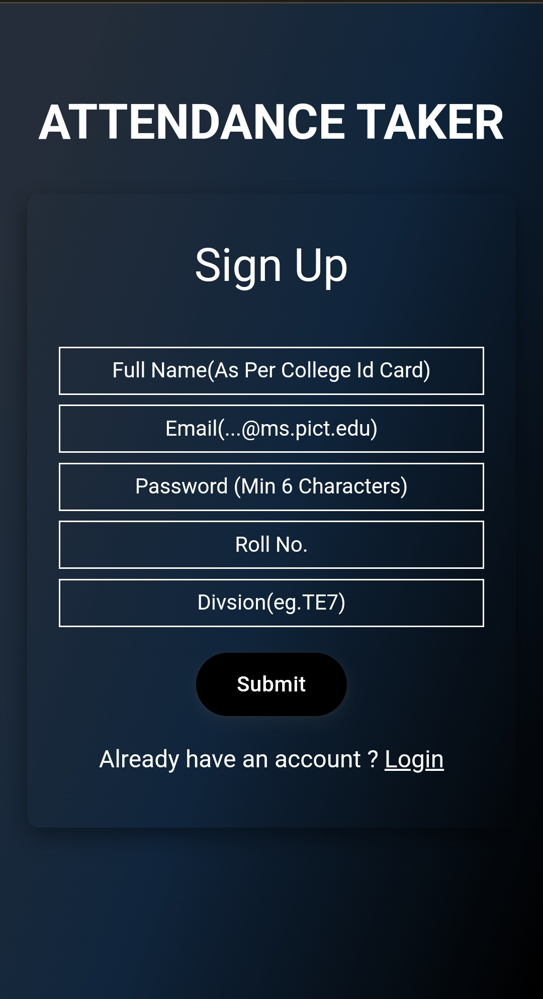
  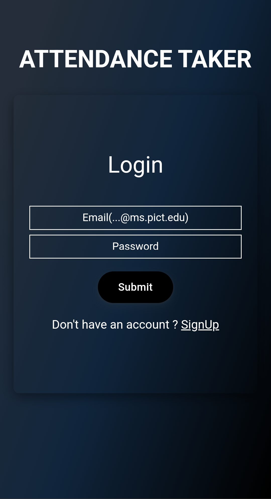
   
  <h2>HomePage | Profile Page</h2>
  
<b>Enter OTP generated by a teacher to mark the attendance</b>

  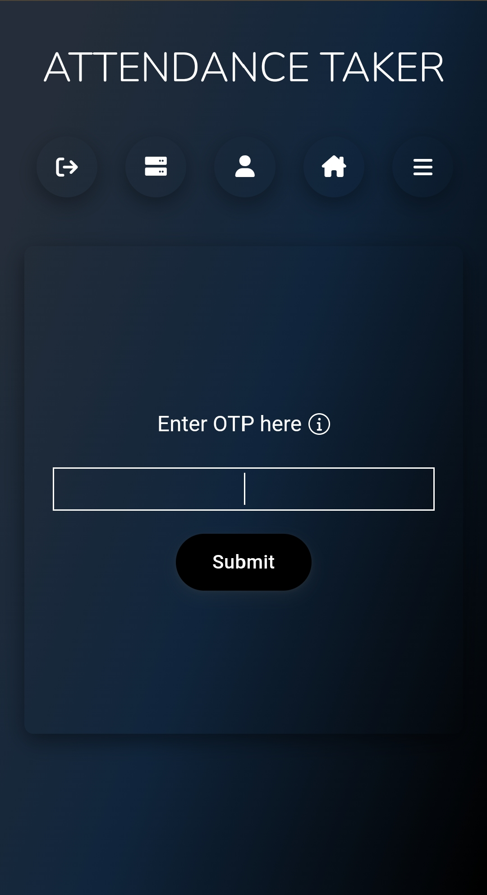
   
  
    
  <h2>Teacher's Dashboard</h2>
  
<b>To generate attendance and download it</b>

  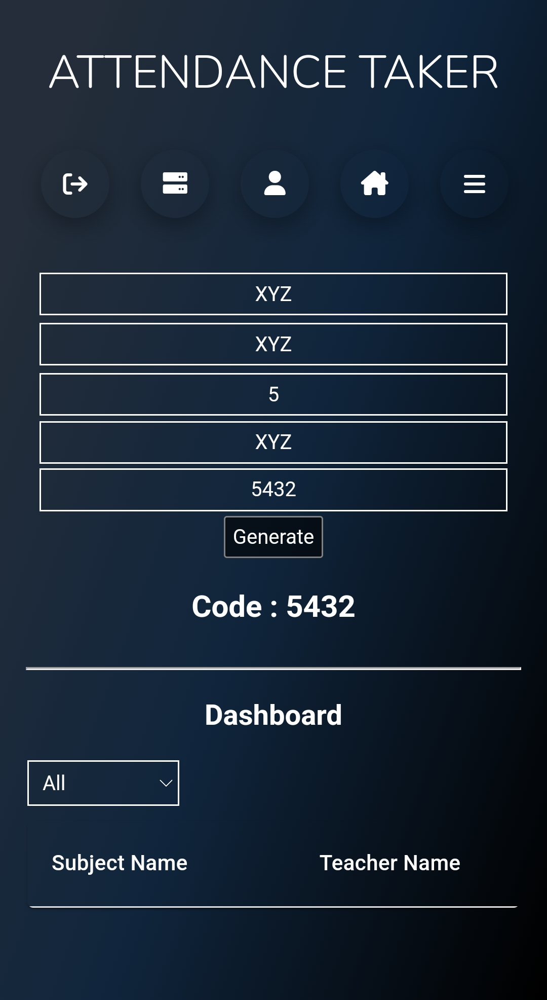
  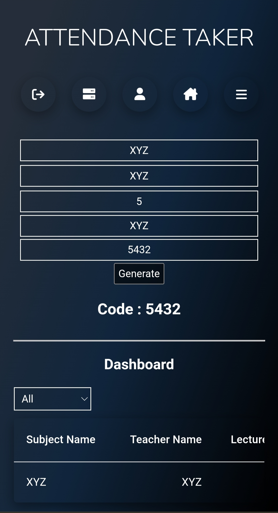
  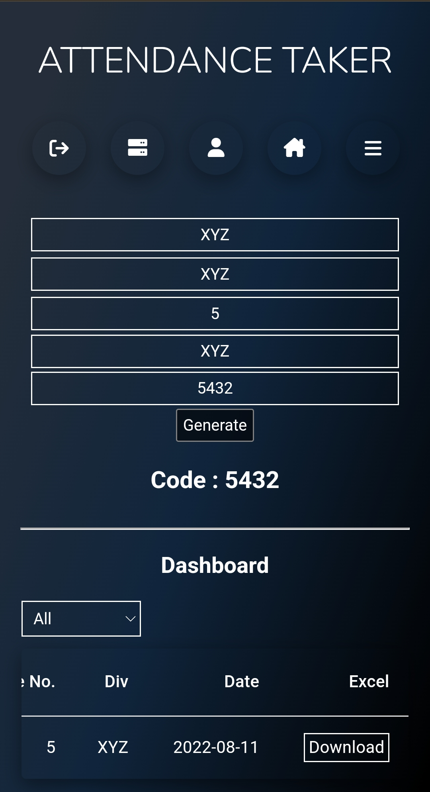
  
<b>Latest Version</b>

  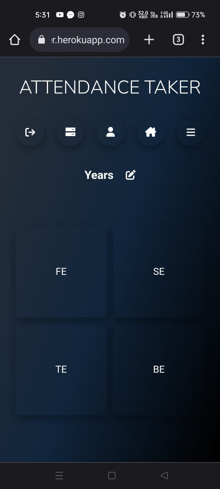
  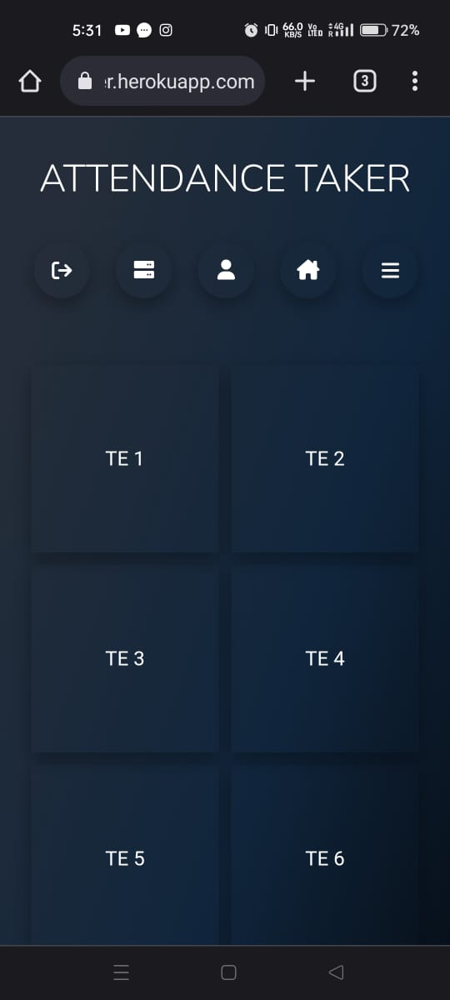
  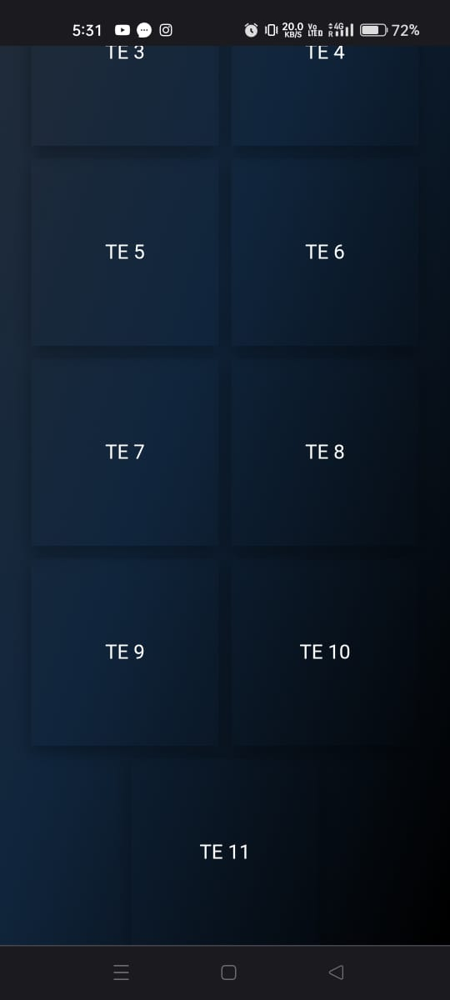
   
  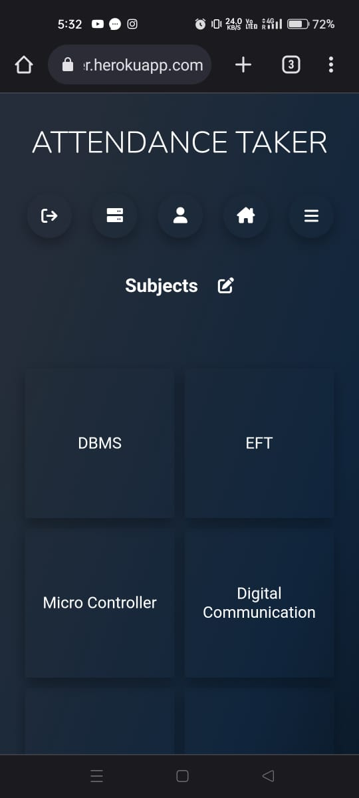
  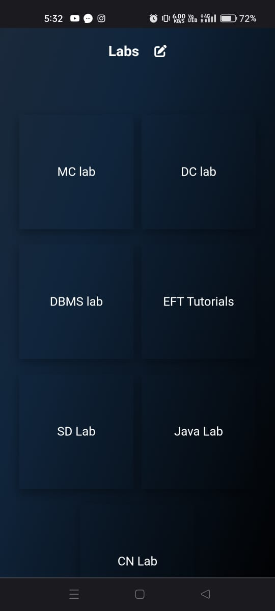
  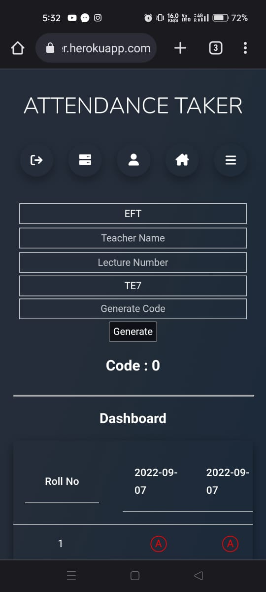
   
  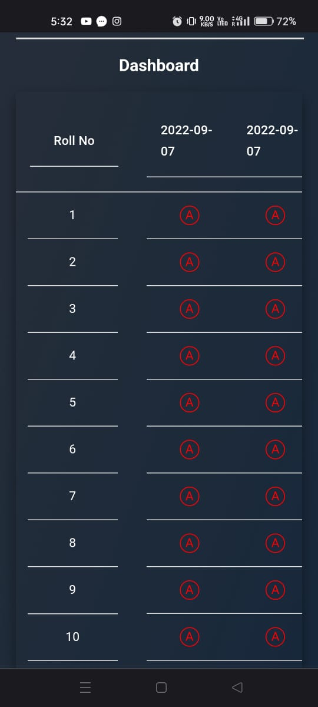
    
    <h2>Admin's Dashboard</h2>
  
<b>To a teacher with their unique id</b>

  
  
<b>Error if student is trying to access admin or teachers dashboard</b>

  

    

